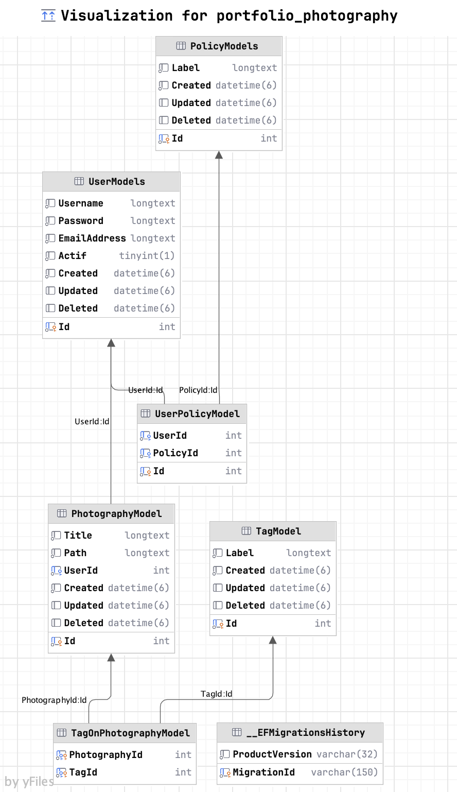

# API with ASP.NET

|                        |
|------------------------|
| Group IGS IPI Toulouse |
| Master IL 2023/2025    | 
| API with ASP.NET       |
| Priscilla Joly         |

## Project

- Faire une API avec 1 CRUD : **CRUD USER**
- Avoir une auhtentification, et gestion d'accès par roles aux controllers (compte users peuvent être en dur si besoin) 
- API Déployée sur un cloud provider 
- BDD => Au choix

## Server

- Configure your **DB credentials** _(DefaultConnection)_ in `appsettings.json` file
- Add your secret **KEY** to generate JWT TOKEN in  `appsettings.json` file

## Client

```bash
cd client
```

```bash
npm install
```

```bash
# http://localhost:4200/
ng serve
```

## Ressources
